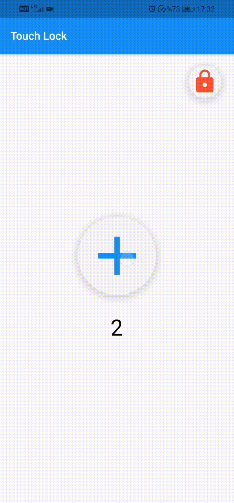

# Touch Lock
###  A beautiful widget that can be presented to the end user to prevent incorrect touches on the screen.

 
##### It is a lock system for children. If you lock the screen, it will not be unlocked without marking the correct number.


Look photos

------------


#### Installation 

    dependencies:
      touch_lock: ^0.0.1

------------

#### Simple Usage

```dart
TouchLock(
      child: Scaffold(
        body: ... ,
      ),
    );
```

------------


#### Advanced Usage


```dart
TouchLock(
      backButton: TextButton(onPressed: null, child: Text('Click Me')) ,
      unlockButton: TextButton(onPressed: null, child: Text('Click Me')) ,
      lockButton: TextButton(onPressed: null, child: Text('Click Me'))... ,
      right: 20 , //Padding
      top: 20 , //Padding
      numbers: ['One','Two','Three','Four','Five','Six','Seven','Eight','Nine'] ,
      text: 'Choose' ,
      buttonSize: 40 ,
      child: ... ,
    );
```

------------

###### Photos
  

------------

Behlul Bozal 
behlulbozal@gmail.com
